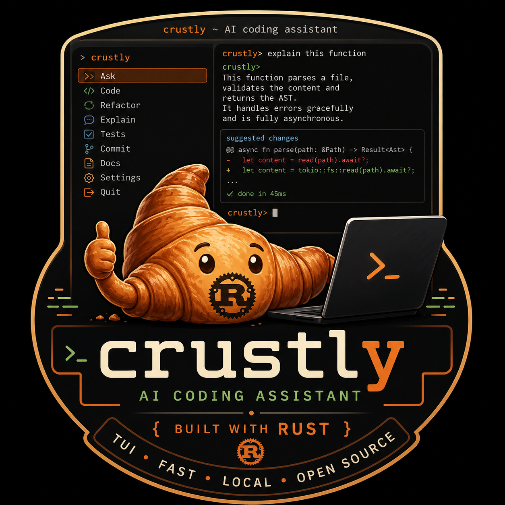
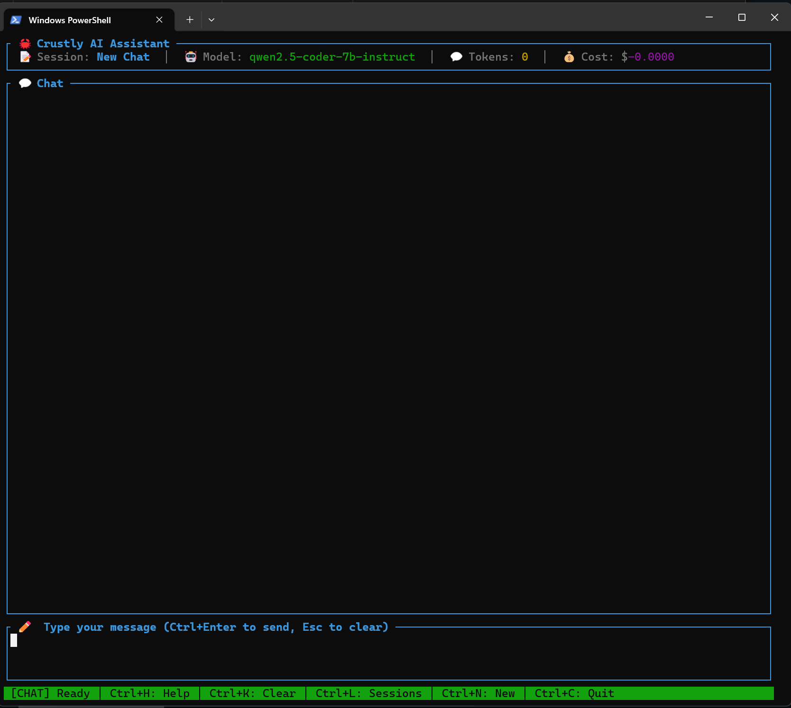
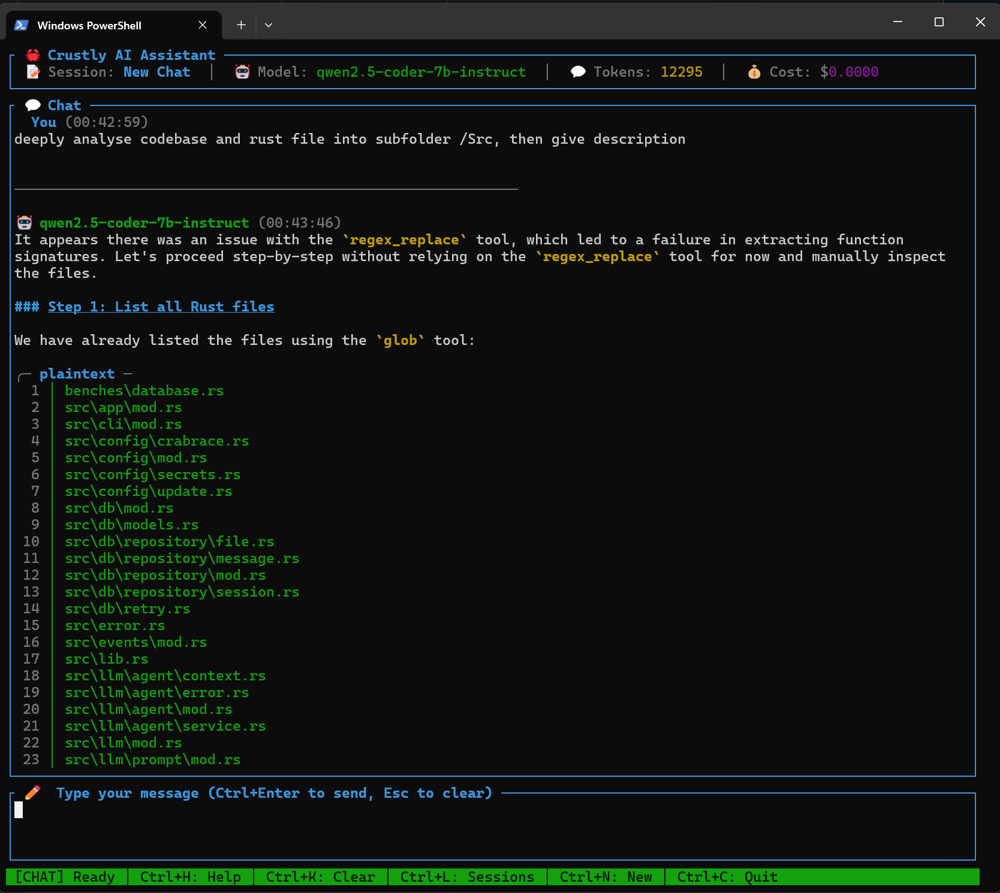
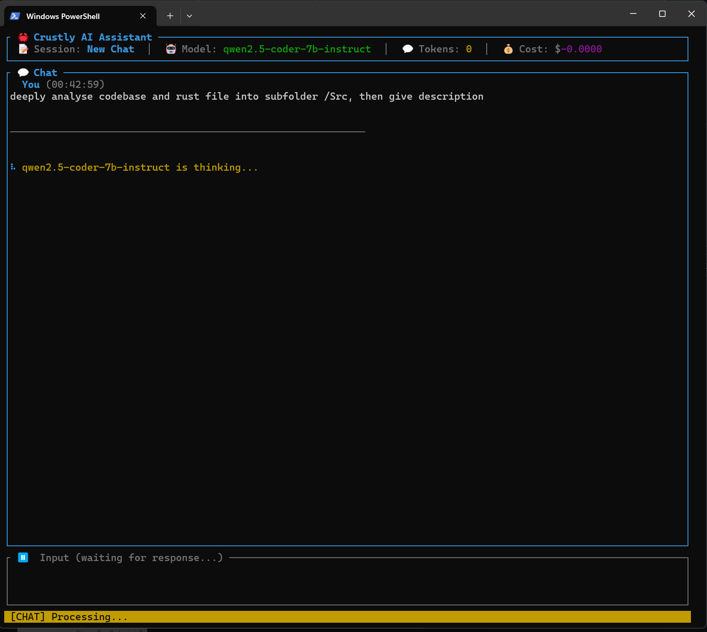
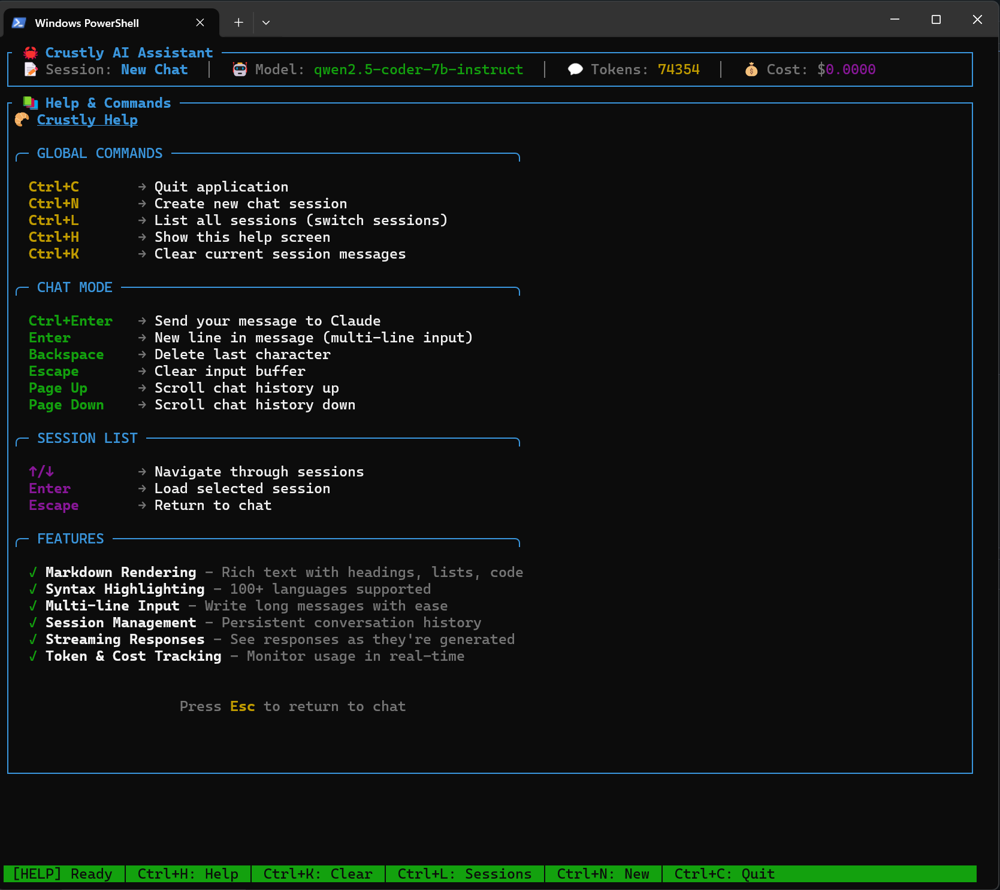

# Crustly 🥐

<p align="center">
  
</p>

**High-Performance Terminal AI Assistant for Software Development**

> A blazingly fast, memory-efficient terminal-based AI assistant written in Rust.
> Rust reimplementation of Crush with 95%+ feature parity and superior performance.

[](https://www.rust-lang.org/)
[](LICENSE.md)
[](https://github.com/jyjeanne/crustly/actions/workflows/ci.yml)
```
   ___             _   _
  / __|_ _ _  _ __| |_| |_  _
 | (__| '_| || (_-<  _| | || |
  \___|_|  \_,_/__/\__|_|\_, |
                         |__/
        🥐 Flaky & Fast
```

---

## Table of Contents

- [📸 Screenshots](#-screenshots)
- [🎯 Main Coding Features](#-main-coding-features)
- [✨ What's New](#-whats-new)
- [🔒 Interactive Approval System](#-interactive-approval-system)
- [⚠️ Important Disclaimers](#️-important-disclaimers)
- [🌐 Supported AI Providers](#-supported-ai-providers)
- [🧩 Reference Coding Models & Hardware Requirements](#-reference-coding-models--hardware-requirements)
- [🚀 Quick Start](#-quick-start)
- [📋 A Note on Claude Max and GitHub Copilot](#-a-note-on-claude-max-and-github-copilot)
- [🏠 Running Crustly with Local LLMs](#-running-crustly-with-local-llms)
- [💡 Best Practices for Using Crustly](#-best-practices-for-using-crustly)
- [👨‍💻 Why Crustly for Coding?](#-why-crustly-for-coding)
- [📋 Plan Mode — Structured Task Planning](#-plan-mode--structured-task-planning)
- [🧠 Native Skills — /review & /spec](#-native-skills--review--spec)
- [🧪 Manual Testing Guide](#-manual-testing-guide)
- [📊 Performance](#-performance)
- [🏗️ Architecture](#️-architecture)
- [📁 Project Structure](#-project-structure)
- [🔍 Debug and Logging](#-debug-and-logging)
- [🛠️ Development](#️-development)
- [📖 Documentation](#-documentation)
- [🤝 Contributing](#-contributing)
- [🐛 Known Issues & Platform-Specific Notes](#-known-issues--platform-specific-notes)
- [📄 License](#-license)
- [🙏 Acknowledgments](#-acknowledgments)
- [📞 Support](#-support)
- [📈 Status](#-status)

---

## 📸 Screenshots

### Main Interface

*Interactive chat interface with syntax highlighting and real-time streaming*

### Deep Code Analysis

*Comprehensive code analysis with detailed insights and suggestions*

### AI Thinking Mode

*Watch the AI reasoning process in real-time as it analyzes your code*

### Help & Commands

*Built-in help system and keyboard shortcuts for efficient navigation*

---

## 🎯 Main Coding Features

**Your AI coding assistant that lives in your terminal.**

### ⚡ **Core Capabilities**

| Feature | Description | Benefit |
|---------|-------------|---------|
| 🔧 **Built-in Tools** | 22 tools: files, shell, web, agents, skills | Direct code manipulation from chat |
| 🔒 **Interactive Approval** | Permission dialogs for dangerous operations | Full control over what AI can do |
| 🎨 **Syntax Highlighting** | 100+ languages with line numbers | Beautiful code display in terminal |
| 🏠 **Local LLM Support** | Run with LM Studio/Ollama | 100% private, $0 cost, offline |
| 💬 **Multi-line Input** | Paste entire functions | Natural code interaction |
| 🧠 **Session Context** | Persistent conversation memory | Maintains project context |
| ⌨️ **Terminal Native** | Fast keyboard shortcuts | No context switching |
| 💰 **Cost Tracking** | Per-message token & cost | Budget control |
| 🌊 **Streaming** | Real-time token-by-token rendering | See code as it's written |
| 🧠 **Reasoning Display** | DeepSeek-R1 / QwQ-32B thinking blocks | Understand AI reasoning, press `t` to expand |

### 🚀 **Quick Example**

```bash
$ crustly

You: "Read src/main.rs"
Crustly: [reads file with syntax highlighting]

You: "Add error handling to the database connection"
Crustly: [modifies file with write tool]

You: "Run cargo test"
Crustly: [executes] ✅ 145 tests passed

You: "Generate documentation for this module"
Crustly: [creates comprehensive docs]
```

### 🔒 **Privacy First**

```bash
# Use local LLMs for sensitive code
# 100% private - code never leaves your machine
# See "Using Crustly with Local LLMs" section below
```

### 💡 **Perfect For**

- ✅ **Code Generation** - Functions, tests, entire modules
- ✅ **Debugging** - Error analysis and fixes with context
- ✅ **Refactoring** - Improve code quality
- ✅ **Documentation** - Generate docs, comments, READMEs
- ✅ **Code Review** - Get feedback on your code, or run `/review` for a multi-pass automated audit
- ✅ **Learning** - Understand complex concepts
- ✅ **Terminal Workflow** - Stay in your flow, no browser tabs

---

## ✨ What's New

### Unreleased — Native `/review` and `/spec` Skills

Two new slash commands work in any project with zero setup, on top of a
generic fix to how `/`-commands are handled. See
[🧠 Native Skills](#-native-skills--review--spec) below for the full
writeup, or the skill source directly at
[src/llm/tools/builtin_skills/](src/llm/tools/builtin_skills/).

- **`/review`** — multi-pass automated code review of the current diff, a
  PR, a branch, or a path. Independent correctness/guideline-compliance/
  security passes dispatch in parallel via the `agent` tool, then a
  second, skeptical pass filters every finding by confidence before
  anything is reported — a review that cries wolf gets ignored.
  `--comment` posts a summary via `gh`, `--fix` applies the surviving
  findings.
- **`/spec`** — native Specification-Driven Development:
  `specify → plan → tasks → implement → analyze`, writing versioned
  artifacts to `specs/<NNN>-<slug>/`. One skill, phase inferred from
  trailing args — `/spec "feature description"` starts a new feature,
  `/spec plan` / `/spec tasks` / `/spec implement` / `/spec analyze`
  advance it. Includes a constitution gate (simplicity / anti-abstraction
  / integration-first) during planning. Modeled on the `spec-driven`
  schema from the same author's external
  [rustyspec](https://github.com/jyjeanne/rustyspec) and
  [solidspec](https://github.com/jyjeanne/solidspec) projects — named the
  polyvalent default among solidspec's 7 workflow schemas — but unlike
  those (separate CLIs that must hand off to an external agent),
  `implement` runs natively in this session: Crustly already is the
  agent, so it drives `task_manager`/`write_file`/`edit_file`/`bash`
  directly and checks off `tasks.md` as it builds.
- **Fixed:** nothing previously routed a typed `/<name>` to the `skill`
  tool that could load it — `/review`, `/spec`, or any project-defined
  skill just sent literal text to the model instead of triggering. Slash
  input now resolves any unmatched `/<name>` through the same lookup
  order `SkillTool` uses (project `.crustly/skills/`, `.claude/skills/`,
  user-global, then a small set of built-ins compiled into the binary)
  before falling back to a plain chat message — off the blocking-safe
  `spawn_blocking` path, so the filesystem walk never stalls TUI
  rendering.

### Unreleased — In-Process llama.cpp Provider

A third local-inference path, alongside the OpenAI-compatible route and
native Ollama: `providers.llama_cpp` loads a `.gguf` file **directly into
the Crustly process** via [`llama-cpp-2`](https://github.com/utilityai/llama-cpp-rs) —
no Ollama daemon, no LM Studio server, no port to start. See
[docs/guides/LLAMA_CPP_GUIDE.md](docs/guides/LLAMA_CPP_GUIDE.md) for setup
and [llama-cpp-2-integration-plan.md](llama-cpp-2-integration-plan.md) for
the full technical design and phase-by-phase implementation record.

- **Streaming, tool calling, GPU offload** — token-by-token streaming,
  the same printed-JSON tool-call recovery Ollama falls back to, and six
  optional GPU backend features (`llama-cpp-cuda`/`-metal`/`-vulkan`/`-rocm`/`-opencl`/`-mkl`)
  with a startup warning if `n_gpu_layers` is set without a matching
  feature compiled in.
- **Grammar-constrained tool calling** (`--features llama-cpp-llguidance`) —
  the moment a response commits to a bare-JSON tool call, decoding swaps
  mid-stream to a sampler that can only produce tokens forming a valid
  call to one of the tools actually offered. Ships with the fixes from two
  rounds of code review: the swap trigger requires the model to have
  already typed a real offered tool's name (not just an opening brace, to
  avoid hijacking legitimate JSON-shaped prose into a fabricated call),
  and the sampler swap correctly carries over repeat-penalty history and
  RNG state instead of discarding it.
- **Local model management** — `Ctrl+G` TUI dialog (pick a downloaded
  `.gguf`, download a new one by URL or `hf:org/repo/file.gguf` shorthand
  with a live progress bar, delete with `Del`) and CLI equivalents
  (`crustly llama-cpp list|pull|rm`).
- **Idle-unload** — `providers.llama_cpp.idle_unload_secs` frees the
  loaded model and its context after a configurable idle period, reloading
  on the next request.
- **Fixed:** responses echoed the requested model name instead of the
  model actually loaded, breaking `ModelRouter`'s tier-based auto-routing
  for this provider.

### v0.5.2 — Local-Model Reliability & Per-Model Tuning

A hardening pass driven by end-to-end testing of the full agentic tool loop
against local Ollama models (qwen2.5-coder, gemma4, ornith).

#### Per-Model Ollama Settings
Different models want different tuning, and one global set silently degrades
every model but the one it was tuned for. Sampling and context can now be set
per model:

```toml
[providers.ollama.models."gemma4:12B"]
num_ctx = 32768        # verbose reasoners need room, or they exhaust the
temperature = 0.6      # window mid-turn and never reach their tool call

[providers.ollama.models."qwen2.5-coder:7b"]
temperature = 0.2      # low temperature for tool-use / coding
```

Each field falls back to the provider-level `[providers.ollama]` value when
unset. The per-model `num_ctx` is also what context compaction budgets
against (`context_window` resolves through the same value), so the requested
and assumed windows can never drift. Applied identically at startup and when
switching models with `Ctrl+W` — both go through a single construction path.

#### Approval That Means Yes
The `security.allow_bash` allowlist is now strictly a **no-prompt shortcut**,
not a wall:

- Allowlisted, operator-free commands run silently (as before).
- Anything else — including commands with shell operators such as
  `mkdir x && cd x && cargo init` — **prompts, showing the full command
  verbatim, and your approval runs exactly that**. Previously these were
  silently refused *after* you approved them, which broke every local
  model's natural `cd <dir> && <cmd>` workflow.
- Operator commands are **never** auto-trusted (the allowlist checks only
  the first token, so `ls && rm -rf /` always prompts), and Plan/read-only
  mode still rejects them outright.

#### Reasoning-Only Answers Surfaced, Not Blank
Reasoning models (ornith, DeepSeek-R1, QwQ — and gemma under context
pressure) sometimes put their *entire* answer in the thinking channel and
return no visible text. That used to render as an empty message with a
collapsed `[Thinking ▸]` toggle. The reasoning is now promoted to the
visible answer with a clear *"this model returned only its reasoning"*
notice — display-only, never persisted into the history the model sees.

#### Tool Calls Recovered from Prose
Some model templates print tool calls as text instead of populating Ollama's
`tool_calls` field. Recovery now also handles calls wrapped in ```json
fences *inside* explanatory prose (qwen2.5-coder's retry pattern after a
rejected command) — strictly: only fenced blocks, only offered tools, only
explicit arguments. Bare JSON mentioned in prose is still never executed.

#### Reliability & UX Fixes
- **Fixed the "Message not found" crash** that broke every `crustly run`
  invocation: sqlx-sqlite does not auto-commit `INSERT ... RETURNING`, so on
  the file-backed WAL pool the new row was invisible to the next pooled
  connection. Message creation now commits an explicit transaction.
- **Fixed the tool-loop detector falsely aborting** consecutive
  `edit_file`/`write_file`/`read_file` calls to *different* paths (it read
  the wrong input key, so distinct calls shared one signature).
- **`Ctrl+W` model switch keeps your config** — it used to rebuild a bare
  provider, dropping per-model settings, sampling, `num_ctx`, `keep_alive`.
- **TUI timestamps are shown in local time** (they were rendered in UTC).
- **`Ctrl+K` (clear session) is refused while a response is generating**,
  instead of deleting messages out from under the in-flight request.
- **Model-not-found errors are actionable** — deleting the configured
  default model from Ollama now yields "install it with `ollama pull`,
  switch with `Ctrl+W`, or update `default_model` in config.toml" instead
  of a raw JSON error body.
- **`--model` CLI flag** — override the configured default model for a
  single invocation of any command: `crustly --model "gemma4:12B" run "..."`.
- **Chat input no longer renders underlined** — the textarea widget
  underlines the cursor line by default, which in a chat input is all the
  text being typed.

### v0.5.0 — Gemini Provider & Claude Code / Qwen Compatibility

#### Native Google Gemini Provider
Gemini joins Anthropic and OpenAI as a third fully-implemented cloud provider. It also serves Google's open-weight **Gemma 3/4** models through the same API — no local GPU or Ollama required, and Gemma usage through the Gemini API is free of charge. Supports streaming, function calling, vision, extended thinking (`thinkingConfig`/`includeThoughts`), and JSON/structured output (`responseSchema`). See the **Supported AI Providers** section below for setup.

#### `apply_patch` Tool
A new 22nd built-in tool: real Codex-compatible multi-file patch support, so the model can describe a coordinated set of file edits in a single structured patch instead of issuing one `edit_file` call per file.

#### Claude Code / Qwen Compatibility Layer
A round of interoperability fixes so Crustly's tool set behaves the same way regardless of which model is driving it:

- **Tool name alias layer** — models trained on Claude Code's or Qwen's tool names resolve to Crustly's built-in tools without a prompt-side mapping
- **`file_path`/`directory` argument aliases and `shell` field compatibility** — accepts the parameter names Claude Code and Qwen actually send
- **`grep` defaults to regex** and both **`grep`/`glob` now respect `.gitignore`**, matching Claude Code/qwen-code semantics
- **Prior-read enforcement** — `edit_file`, `write_file`, and `apply_patch` now require the target file to have been read first in the session, catching a class of blind overwrite mistakes
- **Hardened Qwen Hermes tool-call parsing** — resilient to truncated or malformed JSON tool calls, and MCP tool naming/`edit_file` schema is now compatible with Qwen/Claude Code

#### Bug Fixes & Dependency Upgrades
- Fixed the macOS-only path boundary check incorrectly rejecting valid paths to not-yet-existing files under a symlinked root
- Updated the markdown renderer for the `pulldown-cmark` 0.13 API
- Completed the `ratatui` 0.28 → 0.30 upgrade, migrating off the now-unmaintained `tui-textarea`

See [CHANGELOG.md](CHANGELOG.md) for the full history, including the Phase 4
tool parity release, real-time streaming, reasoning display, context
compaction, smart model routing, parallel tool dispatch, provider failover,
the sandbox/permission policy, episodic memory, the codebase index, MCP
integration, AWS Bedrock support, and the native Ollama provider.

---

### 🆚 **Why Choose Crustly?**

| You Want | Crustly Delivers |
|----------|------------------|
| Privacy | ✅ Local LLM support, data stays on your machine |
| Cost Control | ✅ Token tracking + free local inference |
| Terminal Native | ✅ No GUI, perfect for CLI lovers |
| File Operations | ✅ Built-in read/write/execute tools |
| Context Awareness | ✅ Persistent sessions, never lose context |
| Beautiful Code | ✅ Syntax highlighting for 100+ languages |
| Fast Workflow | ✅ Keyboard shortcuts, streaming responses |

---

## 🔒 Interactive Approval System

**Crustly gives you complete control over dangerous operations with beautiful interactive approval dialogs.**

### How It Works

When Claude wants to modify files or execute commands, Crustly pauses and asks for your permission:

```
┌────────────────────────────────────────────────────┐
│ ⚠️  PERMISSION REQUIRED                            │
├────────────────────────────────────────────────────┤
│ 🔒 Permission Request                              │
│                                                    │
│ Claude wants to use the tool: write_file          │
│                                                    │
│ Description: Write content to a file...            │
│                                                    │
│ ⚠️  Capabilities:                                   │
│    • WriteFiles                                    │
│    • SystemModification                            │
│                                                    │
│ Parameters:                                        │
│    path: "config.json"                             │
│    content: "{ \"debug\": true }"                  │
│                                                    │
│ [A]pprove  [D]eny  [V]iew Details  [Esc] Cancel  │
└────────────────────────────────────────────────────┘
```

### Security Features

✅ **Dangerous operations always require approval:**
- File writes (`write_file`)
- Shell commands (`bash`)
- System modifications

✅ **Safe operations proceed automatically:**
- File reads (`read_file`)
- Information queries

✅ **Full transparency:**
- See exactly what Claude wants to do
- View all parameters before deciding
- Toggle detailed JSON view with `V` key

✅ **Complete control:**
- Press `A` or `Y` to approve
- Press `D` or `N` to deny
- Press `Esc` to cancel
- No way to bypass (unless explicitly configured)

### Auto Mode (Explicitly Bypassing Approval)

Press `Shift+Tab` to cycle through three levels of autonomy, shown at all
times in the status bar:

| Level | Behavior |
|-------|----------|
| `⚙ Interactive` (default) | Every dangerous tool call prompts, as above. |
| `⚡ AutoPlan` | Low-risk tools (reads, searches, etc.) run without prompting. `bash`, `write_file`, `edit_file`, and `code_exec` still prompt. |
| `⚡⚡ FullAuto` | Nothing prompts, including `bash`/`write_file`/`edit_file`/`code_exec`. Use with care. |

Two things stay true no matter which level is active:
- The `[security]` config policy (`deny_tools`, `deny_paths`, `allow_bash`)
  is a separate, earlier check and is **never** bypassed by Auto Mode —
  it's the hard floor.
- Every auto-approved action is logged identically to a manually-approved
  one, so there's a full audit trail regardless of which level was active.

Starts at `Interactive` by default; set `[plan_mode].mode` in
`config.toml` (`"interactive"` / `"auto_plan"` / `"full_auto"`) to change
the starting level, or just cycle it with `Shift+Tab` mid-session.

`crustly run --yolo`/`crustly run --auto-approve` is a related but
separate mechanism for the non-interactive CLI path
(`crustly run "<prompt>"`), not the TUI - it always bypasses everything
unconditionally, with no `AutoPlan`-style tiering.

### Example Workflow

```bash
You: "Create a config file with debug enabled"

[Approval Dialog Appears]
Claude wants to: write_file
Path: config.json
Content: { "debug": true }

[You Press 'A']

Claude: ✅ "I've created the config file at config.json"
```

**Your safety is our priority.** Every dangerous operation requires your explicit approval.

---

## ⚠️ Important Disclaimers

### 🚧 Development Status

**Crustly is currently under active development.** While functional, it is not yet production-ready and may contain bugs or incomplete features.

### 💰 Token Cost Responsibility

**You are responsible for monitoring and managing your own API usage and costs.**

- We are **NOT responsible** for token cost overload from paid cloud AI services (Anthropic Claude, OpenAI, etc.)
- API costs are your responsibility - always monitor your usage
- Set up billing alerts with your cloud provider
- Consider using local LLMs (LM Studio, Ollama) for cost-free operation

### 🔧 Support Limitations

**We are NOT responsible for troubleshooting issues with paid cloud AI services.**

- Cloud API issues should be directed to the respective providers
- Billing questions should go to Anthropic, OpenAI, etc.
- We provide the tool, you manage your API relationships

### 💡 Recommendations

✅ **Always monitor your API usage dashboard**
✅ **Set billing limits with your cloud provider**
✅ **Test with small requests first**
✅ **Use local LLMs for cost-free development**
✅ **Review pricing before using cloud APIs**

> **By using Crustly, you acknowledge these risks and responsibilities.**

---

## 🌐 Supported AI Providers

Crustly currently has **3 fully implemented cloud providers**: **Anthropic**, **OpenAI**, and **Google Gemini**. The OpenAI provider is compatible with any OpenAI-compatible API, enabling local LLMs and alternative providers.

### Implemented Providers

#### ✅ Anthropic Claude (Fully Supported)
- **Models**: Claude 3.5 Sonnet, Claude 3 Opus, Claude 3 Sonnet, Claude 3 Haiku
- **Setup**: `export ANTHROPIC_API_KEY="sk-ant-api03-YOUR_KEY"`
- **Features**: Streaming, tools, vision (via Claude), cost tracking

#### ✅ OpenAI (Fully Supported)
- **Models**: GPT-4 Turbo, GPT-4, GPT-3.5 Turbo
- **Setup**: `export OPENAI_API_KEY="sk-YOUR_KEY"`
- **Features**: Streaming, tools, cost tracking
- **Compatible with**: Any OpenAI-compatible API endpoint

#### ✅ Google Gemini (Fully Supported — also serves Gemma)
- **Models**: gemini-3-pro, gemini-2.5-pro/flash/flash-lite, gemini-2.0-flash, and Google's open-weight **Gemma 4** (`gemma-4-31b-it`, `gemma-4-26b-a4b-it`) and **Gemma 3** models served through the same API
- **Setup**: `export GEMINI_API_KEY="AIza..."` (get a free key at [aistudio.google.com](https://aistudio.google.com/apikey))
- **Features**: Streaming, function calling, vision, extended thinking (`thinkingConfig`/`includeThoughts`), JSON/structured output (`responseSchema`)
- **Why it matters for Gemma**: running Gemma 4/3 through this provider needs no local GPU, no Ollama, and Gemma usage through the Gemini API is free of charge — set `default_model = "gemma-4-31b-it"` under `[providers.gemini]` to use it. See `config.toml.example` for a ready-to-use snippet.

### OpenAI-Compatible Providers

The OpenAI provider works with **any OpenAI-compatible API**, including:

| Provider | Status | Setup |
|----------|--------|-------|
| **LM Studio** | ✅ Tested | `OPENAI_BASE_URL="http://localhost:1234/v1"` |
| **Ollama** | ✅ Compatible | `OPENAI_BASE_URL="http://localhost:11434/v1"` |
| **LocalAI** | ✅ Compatible | `OPENAI_BASE_URL="http://localhost:8080/v1"` |
| OpenRouter | 🟡 Compatible | `OPENAI_BASE_URL="https://openrouter.ai/api/v1"` |
| Groq | 🟡 Compatible | `OPENAI_BASE_URL="https://api.groq.com/openai/v1"` |

### Additional Providers

| Provider | Status | Notes |
|----------|--------|-------|
| **AWS Bedrock** | ✅ Supported | Enable with `--features aws-bedrock`; uses standard AWS credentials |
| Azure OpenAI | 📅 Planned | — |
| Cerebras | 📅 Planned | — |
| Huggingface | 📅 Planned | — |

#### ✅ Native Ollama (via `ollama-rs`)

In addition to the OpenAI-compatible route above (`OPENAI_BASE_URL="http://localhost:11434/v1"`),
Crustly has a **native** Ollama provider built on [`ollama-rs`](https://github.com/pepperoni21/ollama-rs),
enabled with `--features ollama` (or `all-llm`). It talks to Ollama's own `/api/chat` protocol instead
of the OpenAI shim, which unlocks:

- `keep_alive` / `num_ctx` control, plus **per-model overrides** — give each installed model its
  own sampling and context window via `[providers.ollama.models."<name>"]` blocks (see What's New)
- Runtime performance metrics in the TUI header and under each reply: generation throughput
  (tokens/sec), model load time, warm vs. cold start — none of this is available through the
  OpenAI-compatible endpoint
- **`Ctrl+D` Model Download dialog** — pull a model without leaving the TUI: type a name or pick
  from suggestions (already-installed models plus a curated list), watch a live progress bar, and
  cancel with `Esc` if you change your mind. Ollama has no online search API, so suggestions are a
  starting point, not a catalog search — you can always type any `repo:tag` you know.
- Model management from the command line:

  ```bash
  crustly ollama list                              # locally installed models
  crustly ollama pull qwen2.5-coder:7b              # download a model, with live progress
  crustly ollama rm qwen2.5-coder:7b                # delete a model
  crustly ollama show qwen2.5-coder:7b              # license, parameters, template, capabilities
  crustly ollama embed nomic-embed-text "some text"  # generate an embedding vector
  ```

Configure it with `[providers.ollama]` in `config.toml` (see `config.toml.example`) or
`OLLAMA_HOST`/`OLLAMA_MODEL` environment variables. Both the native and OpenAI-compatible routes to
Ollama can be configured side by side; see [`ollama-rs-integration-plan.md`](./ollama-rs-integration-plan.md)
for the full design and current status.

#### ✅ In-process llama.cpp (via `llama-cpp-2`, no server)

A third local-inference path, structurally different from the two above:
`providers.llama_cpp` (enabled with `--features llama-cpp`, compiles native
C++) loads a `.gguf` file **directly into the Crustly process**, via
[`llama-cpp-2`](https://github.com/utilityai/llama-cpp-rs). No Ollama
daemon, no LM Studio server, no port to start.

- Zero idle memory footprint outside an active Crustly session — no
  background process exists to be idle.
- Direct control over GPU offload (`n_gpu_layers`, six backend features:
  `llama-cpp-cuda`/`-metal`/`-vulkan`/`-rocm`/`-opencl`/`-mkl`) and thread
  count, without going through a server's own defaults.
- Same tool-calling reliability mechanism as native Ollama's fallback path
  (printed-JSON recovery, shared code — `src/llm/provider/tool_call_recovery.rs`),
  optionally upgraded with a syntax guarantee via `--features llama-cpp-llguidance`
  (grammar-constrained decoding for bare-JSON tool calls — see the
  [guide](docs/guides/LLAMA_CPP_GUIDE.md#grammar-constrained-tool-calling-optional)).
- **`Ctrl+G` Local Models dialog** — the TUI equivalent of Ollama's `Ctrl+D`:
  pick an already-downloaded `.gguf` file to switch to (shows a "Loading
  model…" state while it loads — not instant, unlike Ollama's swap), type a
  URL or `hf:org/repo/file.gguf` shorthand to download a new one with a live
  progress bar, or `Del` a file you no longer want.
- Model management from the command line:

  ```bash
  crustly llama-cpp list                                                              # locally downloaded .gguf files
  crustly llama-cpp pull hf:Qwen/Qwen2.5-Coder-7B-Instruct-GGUF/qwen2.5-coder-7b-instruct-q4_k_m.gguf
  crustly llama-cpp rm qwen2.5-coder-7b-instruct-q4_k_m.gguf                           # asks for confirmation
  ```

Trade-offs versus the server-based routes above: requires building from
source with the extra Cargo feature (native C++ compilation); switching
models means unloading and reloading a multi-GB file rather than Ollama's
near-instant swap; no sharing one loaded model across multiple clients.
Configure it with `[providers.llama_cpp]` in `config.toml` (see
`config.toml.example`). See
**[docs/guides/LLAMA_CPP_GUIDE.md](docs/guides/LLAMA_CPP_GUIDE.md)** for
the full setup guide and
**[llama-cpp-2-integration-plan.md](./llama-cpp-2-integration-plan.md)**
for the technical design and current implementation status.

### Environment Variables

| Variable | Provider | Required |
|----------|----------|----------|
| `ANTHROPIC_API_KEY` | Anthropic Claude | ✅ For Anthropic |
| `OPENAI_API_KEY` | OpenAI / Compatible APIs | ✅ For OpenAI |
| `OPENAI_BASE_URL` | OpenAI-compatible APIs | Optional (for custom endpoints) |
| `OLLAMA_HOST` (or `OLLAMA_BASE_URL`) | Native Ollama (`--features ollama`) | Optional (default: `http://localhost:11434`) |
| `OLLAMA_MODEL` | Native Ollama (`--features ollama`) | Optional (default model override) |

### Example Configuration

```bash
# Linux/Mac
export ANTHROPIC_API_KEY="sk-ant-api03-YOUR_KEY_HERE"
export OPENAI_API_KEY="sk-YOUR_OPENAI_KEY"

# Windows PowerShell
$env:ANTHROPIC_API_KEY="sk-ant-api03-YOUR_KEY_HERE"
$env:OPENAI_API_KEY="sk-YOUR_OPENAI_KEY"
```

### Local LLMs (No API Key Required)

You can also use Crustly with **local LLMs** for 100% private, cost-free operation:
- **LM Studio** - Desktop app with OpenAI-compatible API ✅ **Ready to use!**
- **Ollama** - Command-line local model runner ✅ **Ready to use!**
- **LocalAI** - Self-hosted OpenAI alternative ✅ **Ready to use!**

**Quick Start with LM Studio:**
```bash
# 1. Start LM Studio with a model loaded
# 2. Set environment variable
export OPENAI_BASE_URL="http://localhost:1234/v1"

# 3. Run Crustly
cargo run
```

See [LM_STUDIO_GUIDE.md](docs/guides/LM_STUDIO_GUIDE.md) for complete setup instructions.

---

## 🧩 Reference Coding Models & Hardware Requirements

Three models cover the three roles a coding agent needs — writing code, planning/reasoning, and reviewing/documenting — and are Crustly's current reference points for each:

| Model | Role | Params | Context (Crustly) | Provider | Serving |
|---|---|---|---|---|---|
| **[Qwen3-Coder-Next](https://huggingface.co/Qwen/Qwen3-Coder-Next)** ⭐ | Primary coding agent | 80B MoE (~3B active/token) | 256K | `providers.qwen` (local) | vLLM / SGLang |
| **Qwen3.6-27B** | Reasoning & planning | 27B dense | 256K (open-weight); cloud releases may support up to 1M | `providers.qwen` (local or DashScope) | vLLM / SGLang / DashScope |
| **Gemma 4 26B** (`gemma-4-26b-a4b-it`) | Architecture, docs, review | 25.2B MoE (~3.8B active/token) | 128K via Gemini API; up to 256K on the Ollama-hosted GGUF | `providers.gemini` (free) or native Ollama | Gemini API or Ollama |

All three are wired up in Crustly's provider layer today: `qwen3-coder-next` and `qwen3.6-27b` are registered in the Qwen provider with their real 256K context window, and the provider auto-selects the OpenAI tool-call parser for Qwen3-Coder-Next to match its documented vLLM/SGLang serving recipe. Gemma 4 26B is served through the Gemini provider free of charge, or locally via `ollama pull gemma4:26b`. See [QWEN_INTEGRATION.md](docs/guides/QWEN_INTEGRATION.md) for Qwen setup/config and [LM_STUDIO_GUIDE.md](docs/guides/LM_STUDIO_GUIDE.md#gemma-4-google) for the Gemma 4 hardware breakdown.

### Hardware requirements

> Figures below are estimated from published parameter counts using standard quantization overhead (~0.55–0.6 bytes/param at Q4/INT4, 2 bytes/param at BF16/FP16) — the same method used elsewhere in this README and in [LM_STUDIO_GUIDE.md](docs/guides/LM_STUDIO_GUIDE.md). Check each model's card for vendor-confirmed numbers before provisioning production hardware.

#### Qwen3-Coder-Next (80B MoE, ~3B active/token)

Designed for datacenter/workstation vLLM or SGLang serving rather than a single consumer GPU — the full expert set must be resident for production-grade throughput.

| Deployment | VRAM | System RAM | Notes |
|---|---|---|---|
| **BF16/FP16 (vLLM/SGLang default)** | ~160 GB | 32 GB+ | Needs multi-GPU, e.g. 2× A100/H100 80GB, or split across 4× 48GB workstation GPUs with tensor parallelism |
| **AWQ/GPTQ INT4 (vLLM quantized)** | ~45–50 GB | 32 GB+ | Fits a single 80GB A100/H100, or 2× 24GB consumer GPUs (e.g. RTX 4090) with tensor parallelism |
| Disk | ~45 GB (INT4) – ~160 GB (BF16 safetensors) | — | — |

```bash
vllm serve Qwen/Qwen3-Coder-Next \
    --enable-auto-tool-choice \
    --tool-call-parser qwen3_coder
```

No local GPU? Use DashScope cloud instead (`api_key` + `region` under `[providers.qwen]` — see [QWEN_INTEGRATION.md](docs/guides/QWEN_INTEGRATION.md)) once Qwen3-Coder-Next is available there.

#### Qwen3.6-27B (27B dense)

Comparable footprint to other 27B-class dense models already in this README (Gemma-3-27B-IT, Qwen2.5-Coder-32B).

| Deployment | VRAM | System RAM | Notes |
|---|---|---|---|
| **Q4_K_M (GGUF via Ollama/LM Studio)** | ~20 GB | 40 GB | Best speed/quality balance for local use |
| **BF16/FP16 (vLLM/SGLang)** | ~54 GB | 32 GB+ | Fits a single 80GB A100/H100 |
| Cloud (DashScope) | none | none | Recommended default for the reasoning/planning tier if you don't have a spare GPU |

#### Gemma 4 26B (25.2B MoE, ~3.8B active/token)

| Deployment | VRAM | System RAM | Notes |
|---|---|---|---|
| **Gemini API** (`providers.gemini`) | none | none | Free of charge, 128K context, no GPU or Ollama required — recommended default |
| **Ollama** (`ollama pull gemma4:26b`, Q4_K_M) | ~12 GB | 32 GB | Up to 256K context locally; see the exact config snippet in [LM_STUDIO_GUIDE.md](docs/guides/LM_STUDIO_GUIDE.md#gemma-4-google) |

---

## 🚀 Quick Start

### Prerequisites

- **Rust 1.75+** - [Install Rust](https://rustup.rs/)
- **API Key** from your preferred provider (see Supported AI Providers above)
- **SQLite** (bundled with sqlx)
- **Git** (optional)

### Installation

```bash
# Clone the repository
git clone https://github.com/jyjeanne/crustly.git
cd crustly

# Build the project
cargo build --release

# Set your API key (choose your preferred provider)
export ANTHROPIC_API_KEY="sk-ant-api03-YOUR_KEY_HERE"
# or
export OPENAI_API_KEY="sk-YOUR_OPENAI_KEY"
# See "Supported AI Providers" section for all options

# Initialize configuration (optional)
cargo run -- init

# Run interactive mode
cargo run
```

### First Run

1. **Set your API key** (choose your preferred provider):

**Option A: Secure OS Keyring (Recommended)**
```bash
# Store API key securely in OS credential manager
cargo run -- keyring set anthropic YOUR_API_KEY_HERE
# or
cargo run -- keyring set openai YOUR_API_KEY_HERE

# List stored keys
cargo run -- keyring list

# View stored key (displays in terminal)
cargo run -- keyring get anthropic
```

Benefits:
- ✅ Encrypted by OS (Windows Credential Manager / macOS Keychain / Linux Secret Service)
- ✅ Not stored in plaintext files
- ✅ Automatically loaded on startup
- ✅ Secure and persistent

**Option B: Environment Variables (Temporary)**
```bash
# Example with Anthropic (Linux/Mac)
export ANTHROPIC_API_KEY="sk-ant-api03-YOUR_KEY_HERE"

# Example with OpenAI (Linux/Mac)
export OPENAI_API_KEY="sk-YOUR_OPENAI_KEY"

# Windows PowerShell
$env:ANTHROPIC_API_KEY="sk-ant-api03-YOUR_KEY_HERE"
# or
$env:OPENAI_API_KEY="sk-YOUR_OPENAI_KEY"
```

> 💡 Crustly automatically tries keyring first, then falls back to environment variables.
> 💡 See the **Supported AI Providers** section above for the complete list of environment variables.

2. **Launch the TUI:**
```bash
cargo run
```

3. **Start chatting:**
   - Type your message
   - Press `Enter` to send (`Shift+Enter`/`Alt+Enter` for a new line,
     `Ctrl+Enter` still works too)
   - Press `Ctrl+H` to see all available commands and help
   - Press `Ctrl+C` to quit

> 💡 **Tip:** Press `Ctrl+H` at any time to display the comprehensive help screen with all keyboard shortcuts and features!

### Usage

```bash
# Interactive TUI mode (default)
cargo run
# or
cargo run -- chat

# Non-interactive mode (single command)
cargo run -- run "What is Rust?"

# With JSON output
cargo run -- run --format json "List 3 programming languages"

# With markdown output
cargo run -- run --format markdown "Explain async/await"

# Initialize configuration
cargo run -- init

# Show current configuration
cargo run -- config

# Show configuration with secrets
cargo run -- config --show-secrets

# Initialize database
cargo run -- db init

# Show database statistics
cargo run -- db stats

# Enable debug mode (creates log files)
cargo run -- -d
# or
cargo run -- --debug

# Log management commands
cargo run -- logs status    # Check logging status
cargo run -- logs view      # View recent logs
cargo run -- logs clean     # Clean old log files
```

---

## 📋 A Note on Claude Max and GitHub Copilot

**Crustly only supports model providers through official, compliant APIs.**

We do not support or endorse any methods that rely on personal Claude Max and GitHub Copilot accounts or OAuth workarounds, which violate Anthropic and Microsoft's Terms of Service.

### Official API Access Only

✅ **Supported & Compliant:**
- Anthropic API (with official API key from console.anthropic.com)
- OpenAI API (with official API key)
- Local LLMs (LM Studio, Ollama, LocalAI)
- Any OpenAI-compatible API endpoint with proper authorization

❌ **Not Supported & Against ToS:**
- Using Claude Max subscription through unofficial methods
- Using GitHub Copilot through OAuth workarounds
- Reverse-engineered or unofficial API endpoints
- Account-sharing or credential-borrowing schemes

### Why This Matters

- **Legal Compliance** - Using unofficial methods violates provider Terms of Service
- **Account Safety** - Your accounts could be suspended or banned
- **Security Risks** - Unofficial methods may expose your credentials
- **Ethical Development** - We respect provider agreements and policies

### Recommended Alternatives

If you can't afford cloud API costs, consider these legitimate alternatives:
1. **Local LLMs** - Run models on your own hardware (see section below)
2. **API Credits** - Many providers offer free trial credits
3. **Educational Programs** - Some providers offer discounts for students/researchers

---

## 🏠 Running Crustly with Local LLMs

Crustly runs entirely offline for 100% private, $0-cost inference, via
three different paths — two against a local model server, one with no
server at all. Full step-by-step setup, troubleshooting, and model
recommendations now live in dedicated guides:

### LM Studio
Desktop app with a built-in model downloader and an OpenAI-compatible local
server. Recommended if you want a GUI for browsing and swapping models.
See **[docs/guides/LM_STUDIO_GUIDE.md](docs/guides/LM_STUDIO_GUIDE.md)** for
installation, model recommendations (Qwen2.5-Coder, Gemma 4, Llama, Ornith
9B), troubleshooting, and performance benchmarks.

### Ollama
Lightweight background service with short, memorable model names — the
recommended local backend since it needs no GUI and reconnects instantly.
See **[docs/guides/OLLAMA_GUIDE.md](docs/guides/OLLAMA_GUIDE.md)** for
installation, model pulls, multi-model workflows, and troubleshooting.

### llama.cpp (no server, in-process)
Skips the server entirely: loads a `.gguf` file directly into the Crustly
process itself via the `llama-cpp-2` crate — no daemon to install or keep
running, at the cost of a from-source build (`--features llama-cpp`,
compiles native C++) and a slower model-switch than Ollama's near-instant
swap. See **[docs/guides/LLAMA_CPP_GUIDE.md](docs/guides/LLAMA_CPP_GUIDE.md)**
for build requirements, getting a model, GPU acceleration, and
troubleshooting — and
**[llama-cpp-2-integration-plan.md](llama-cpp-2-integration-plan.md)** for
the full technical design.

### Configuring `crustly.toml`
All three routes are configured the same way, through `crustly.toml` or
environment variables. See
**[docs/guides/CONFIGURATION_GUIDE.md](docs/guides/CONFIGURATION_GUIDE.md)**
for the full option reference, file locations per OS, and example configs for
LM Studio, Ollama, cloud APIs, and hybrid setups.

---

## 💡 Best Practices for Using Crustly

Effective prompts are specific, reference real files/functions, and state the
desired outcome — Crustly's tools do the exploration for you. See
**[docs/guides/PROMPT_BEST_PRACTICES.md](docs/guides/PROMPT_BEST_PRACTICES.md)**
for sample prompts by task type (codebase exploration, debugging, feature
implementation, documentation, dependency analysis), patterns to avoid, and a
full example workflow session.

---

## 👨‍💻 Why Crustly for Coding?

A closer look at the coding-specific feature set — tool execution, syntax
highlighting, session context, streaming, cost tracking — plus common coding
task walkthroughs, a typical developer workflow, and a comparison with other
terminal coding assistants. See
**[docs/CODING_FEATURES.md](docs/CODING_FEATURES.md)** for the full writeup.

---

## 📋 Plan Mode — Structured Task Planning

For complex, multi-step work, ask Crustly to plan first: it breaks the task
into a reviewable, dependency-ordered set of steps you approve before
anything executes. See **[docs/PLAN_MODE_USER_GUIDE.md](docs/PLAN_MODE_USER_GUIDE.md)**
for the full workflow, keyboard shortcuts, `PLAN.md` format, plan lifecycle,
sample prompts, troubleshooting, and FAQ.

---

## 🧠 Native Skills — /review & /spec

Skills are `SKILL.md` prompt files the `skill` tool can load — Crustly
ships two built into the binary so they work in any project with no setup,
and any project can override either by dropping its own
`.crustly/skills/<name>/SKILL.md` (or `.claude/skills/<name>/SKILL.md`)
of the same name.

### `/review` — multi-pass code review

```
/review                  # review the current diff / open PR
/review 123               # review PR #123
/review --comment         # also post a summary comment via gh
/review --fix             # apply the surviving findings
```

Independent correctness, guideline-compliance, and security passes
dispatch in parallel via the `agent` tool, each scoped to only the
relevant diff and context. A second, skeptical pass then tries to
disprove each finding before it's reported — findings that don't survive
scrutiny are dropped rather than shown, on the theory that a review that
cries wolf gets ignored.

### `/spec` — Specification-Driven Development

```
/spec Add CSV export to reports   # start a new feature: specs/001-.../spec.md
/spec plan                        # architecture plan + constitution gate
/spec tasks                       # phased, traceable task breakdown
/spec implement                   # builds it natively, checks off tasks.md
/spec analyze                     # traceability + test verdict: READY / NEEDS WORK
```

One skill, phase inferred from the trailing argument. Every feature gets
a versioned `spec.md` → `plan.md` → `tasks.md` under `specs/<NNN>-<slug>/`,
so scope and requirements survive contact with an AI agent instead of
being renegotiated silently mid-implementation.

The workflow is modeled on the `spec-driven` schema from the same
author's [rustyspec](https://github.com/jyjeanne/rustyspec) and
[solidspec](https://github.com/jyjeanne/solidspec) — external CLI tools
implementing several SDD methodologies, of which `spec-driven` is
documented as the polyvalent default. The key difference here: those
tools are separate processes that must shell out to an external agent's
CLI for the `implement` phase. Crustly doesn't need to — `implement` runs
natively in the same session, driving `task_manager`, `write_file`,
`edit_file`, and `bash` directly against `tasks.md`.

### Writing your own

Any `.crustly/skills/<name>/SKILL.md` in your project (or
`~/.config/crustly/skills/<name>/SKILL.md` globally) becomes a slash
command automatically — no registration step. Run `/skills` to see every
skill currently discoverable, project-local and built-in alike.

---

## 🧪 Manual Testing Guide

For a hands-on pass covering setup verification, interactive chat, session
management, cost tracking, multi-turn context, and configuration management,
see **[docs/guides/MANUAL_TESTING_GUIDE.md](docs/guides/MANUAL_TESTING_GUIDE.md)**.

---

## 📊 Performance

### Test Suite Performance

| Test Suite | Tests | Time | Status |
|------------|-------|------|--------|
| Unit Tests | 163 | ~2.3s | ✅ |
| Integration Tests | 9 | ~0.1s | ✅ |
| **Total** | **172** | **~2.4s** | **✅** |

### Database Operations

| Operation | Time | Notes |
|-----------|------|-------|
| Session creation | < 10ms | In-memory SQLite |
| Message insert | < 5ms | With token tracking |
| Message list query | < 20ms | Per session |
| Session list query | < 30ms | All sessions |

### Application Performance

| Metric | Current | Target | Status |
|--------|---------|--------|--------|
| Test Execution | ~2.7s | < 5s | ✅ |
| Startup Time | TBD | < 50ms | 📊 Needs benchmarking |
| Memory Usage (idle) | ~15MB | < 25MB | ✅ |
| Memory Usage (100 msgs) | ~20MB | < 50MB | ✅ |

---

## 🏗️ Architecture

```
Presentation Layer
    ↓
CLI (Clap) + TUI (Ratatui)
    ↓
Application Layer
    ↓
Service Layer (Session, Message, Agent)
    ↓
Data Access Layer (SQLx + SQLite)
    ↓
Integration Layer (LLM, LSP, MCP)
```

**Key Technologies:**
- **Tokio** - Async runtime
- **Axum** - HTTP server (future)
- **Ratatui** - Terminal UI
- **SQLx** - Database access
- **Clap** - CLI parsing
- **Tower-LSP** - LSP client
- **Crabrace** - Provider registry

---

## 📁 Project Structure

```
crustly/
├── src/
│   ├── cli/           # Command-line interface
│   ├── app/           # Application lifecycle
│   ├── config/        # Configuration management
│   │   └── crabrace.rs # Crabrace integration ✅
│   ├── db/            # Database layer (SQLx)
│   ├── services/      # Business logic
│   ├── llm/           # LLM integration
│   │   ├── agent/     # Agent service
│   │   ├── provider/  # LLM providers
│   │   ├── tools/     # Tool system
│   │   └── prompt/    # Prompt engineering
│   ├── tui/           # Terminal UI
│   ├── lsp/           # LSP integration
│   ├── mcp/           # MCP support
│   └── utils/         # Utilities
├── tests/             # Integration tests
├── benches/           # Benchmarks
└── docs/              # Documentation
```

---

## 🔍 Debug and Logging

Crustly is silent by default — no log files are created during normal use.
Pass `-d`/`--debug` to enable verbose logging to `.crustly/logs/` (daily
rotation, 7-day auto-cleanup), and use `crustly logs status|view|clean|open`
to manage them. See **[docs/guides/DEBUG_LOGGING.md](docs/guides/DEBUG_LOGGING.md)**
for log levels, file format, environment variable overrides, and
troubleshooting.

---

## 🛠️ Development

### Build from Source

```bash
# Development build
cargo build

# Release build (optimized)
cargo build --release

# With profiling
cargo build --release --features profiling

# Run tests
cargo test

# Run benchmarks
cargo bench

# Format code
cargo fmt

# Lint
cargo clippy -- -D warnings
```

For the forward-looking plan (what's shipped, what's next, target
milestones), see **[ROADMAP.md](ROADMAP.md)**.

---

## 📖 Documentation

### Guides
- **[LM Studio Guide](docs/guides/LM_STUDIO_GUIDE.md)** - Local LLM setup, model recommendations, troubleshooting
- **[Ollama Guide](docs/guides/OLLAMA_GUIDE.md)** - Native Ollama setup, model management, troubleshooting
- **[Configuration Guide](docs/guides/CONFIGURATION_GUIDE.md)** - `crustly.toml` reference and example configs
- **[Prompting Best Practices](docs/guides/PROMPT_BEST_PRACTICES.md)** - Effective prompt patterns
- **[Plan Mode User Guide](docs/PLAN_MODE_USER_GUIDE.md)** - Structured task planning workflow
- **[Manual Testing Guide](docs/guides/MANUAL_TESTING_GUIDE.md)** - Step-by-step testing instructions
- **[Debug & Logging](docs/guides/DEBUG_LOGGING.md)** - Log levels, file locations, troubleshooting
- **[Coding Features](docs/CODING_FEATURES.md)** - Coding-specific feature deep dive
- **[User Guide](docs/guides/README_USER_GUIDE.md)** - Complete user guide with examples

### Project
- **[CHANGELOG.md](CHANGELOG.md)** - Full version history
- **[ROADMAP.md](ROADMAP.md)** - Completed milestones and forward-looking plan
- **[Architecture](docs/ARCHITECTURE.md)** - Full architecture reference
- **[Project History](docs/PROJECT_HISTORY.md)** - Archived pre-1.0 sprint log (historical, not current)

### Development Documentation
- **[Testing Summary](docs/development/TESTING_SUMMARY.md)** - Test coverage and infrastructure
- **[Technical Specification](docs/CRUSTLY_SPECIFICATION_FINAL.md)** - Complete spec (v3.0)
- **[Implementation Summary](docs/IMPLEMENTATION_SUMMARY.md)** - Development roadmap
- **[Crabrace Integration](docs/guides/CRABRACE_INTEGRATION.md)** - Provider registry guide
- **[Build Notes](docs/guides/BUILD_NOTES.md)** - Build instructions & known issues
- **[Specification Review](docs/SPECIFICATION_REVIEW.md)** - Feature analysis

---

## 🤝 Contributing

Contributions welcome! Please read [CONTRIBUTING.md](CONTRIBUTING.md) for guidelines.

### Development Setup

1. Install Rust 1.75+
2. Clone the repository
3. Run `cargo build`
4. Make changes
5. Run tests: `cargo test`
6. Submit PR

---

## 🐛 Known Issues & Platform-Specific Notes

### Windows Build Requirements

Building Crustly on Windows requires additional tools due to native dependencies:

**Error you might see:**
```
error: failed to run custom build command for `aws-lc-sys`
error: Error calling dlltool 'dlltool.exe': program not found
```

**Root Cause:**
The `aws-lc-sys` crate (used by cryptographic libraries) requires CMake and NASM for Windows builds.

**Solutions (choose one):**

**Option 1: Install Build Tools (Recommended for Windows development)**
1. Install [CMake](https://cmake.org/download/) (Windows x64 Installer)
   - During installation, choose "Add CMake to the system PATH"
2. Install [NASM](https://www.nasm.us/)
   - Download Windows 64-bit installer
   - Add to PATH: `C:\Program Files\NASM`
3. Install [Visual Studio Build Tools](https://visualstudio.microsoft.com/downloads/)
   - Select "Desktop development with C++"
4. Restart terminal and run: `cargo build`

**Option 2: Use WSL2 (Recommended for Linux-like environment)**
```bash
# In WSL2 Ubuntu
curl --proto '=https' --tlsv1.2 -sSf https://sh.rustup.rs | sh
sudo apt-get update
sudo apt-get install build-essential pkg-config libssl-dev
git clone https://github.com/jyjeanne/crustly.git
cd crustly
cargo build --release
```

**Option 3: Use Pre-built Binaries (Coming Soon)**
- Download from [Releases](https://github.com/jyjeanne/crustly/releases)

**Platform-specific notes:**
- **macOS**: No additional dependencies required
- **Linux**: Requires `build-essential`, `pkg-config`, `libssl-dev`
- **Windows**: See build requirements above

For detailed build troubleshooting, see [BUILD_NOTES.md](docs/guides/BUILD_NOTES.md).

---

## 📄 License

**FSL-1.1-MIT License**

- **Functional Source License (FSL) 1.1** - First 2 years
- **MIT License** - After 2 years from release

See [LICENSE.md](LICENSE.md) for details.

---

## 🙏 Acknowledgments

- **Crush (Go)** - Original implementation
- **Crabrace** - Provider registry (Rust port of Catwalk)
- **Anthropic** - API
- **Ratatui Community** - Terminal UI framework

---

## 📞 Support

- **Issues:** [GitHub Issues](https://github.com/jyjeanne/crustly/issues)
- **Discussions:** [GitHub Discussions](https://github.com/jyjeanne/crustly/discussions)
- **Documentation:** [docs/](docs/)

---

## 📈 Status

Crustly is under active development — see the **[✨ What's New](#-whats-new)**
section above and **[CHANGELOG.md](CHANGELOG.md)** for the current feature
set, and **[ROADMAP.md](ROADMAP.md)** for what's shipped vs. planned. The
Sprint 0-12 development log from the pre-1.0 bring-up phase is archived at
**[docs/PROJECT_HISTORY.md](docs/PROJECT_HISTORY.md)** for reference.

---

**Built with** ❤️ **and Rust 🦀**

**"Why 'Crustly'?"** 🥐
Like a croissant's flaky layers, Crustly has a layered architecture.
Crusty on the outside (fast), soft on the inside (approachable).
