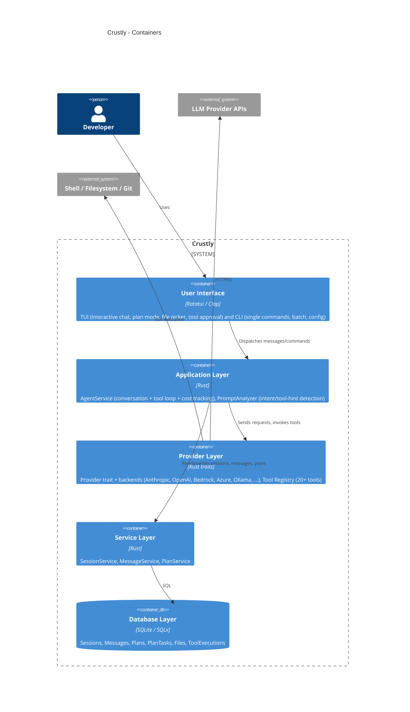

# Containers (C4 L2)

Hand-authored from `docs/ARCHITECTURE.md` section 1 ("High-Level Architecture"),
which lays out five layers: User Interface, Application, Provider, Service, and
Database. Update this alongside that section if the layering changes.

## Notes

- This mirrors `docs/ARCHITECTURE.md` §1 exactly; treat that document as the
  narrative source and this diagram as its GitHub-renderable summary.
- Cross-check against `docs/graph/GRAPH_REPORT.md`'s community list
  periodically - if a community there doesn't map cleanly onto one of these
  five containers, either this diagram or the actual module boundaries have
  drifted.
