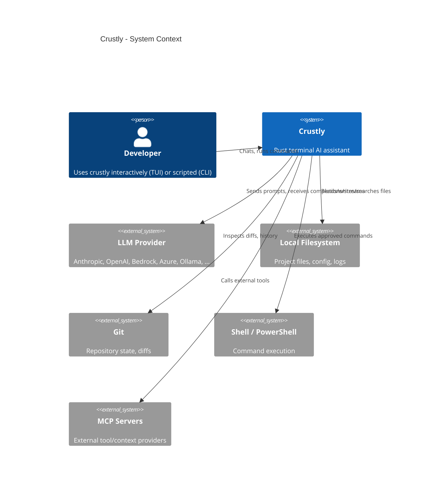

# System Context (C4 L1)

Hand-authored from `docs/ARCHITECTURE.md` (System Overview). Update when the
external integrations crustly talks to change.

```mermaid
C4Context
    title Crustly - System Context

    Person(developer, "Developer", "Uses crustly interactively (TUI) or scripted (CLI)")

    System(crustly, "Crustly", "Rust terminal AI assistant")

    System_Ext(llm, "LLM Provider", "Anthropic, OpenAI, Bedrock, Azure, Ollama, ...")
    System_Ext(fs, "Local Filesystem", "Project files, config, logs")
    System_Ext(git, "Git", "Repository state, diffs")
    System_Ext(shell, "Shell / PowerShell", "Command execution")
    System_Ext(mcp, "MCP Servers", "External tool/context providers")

    Rel(developer, crustly, "Chats, runs commands")
    Rel(crustly, llm, "Sends prompts, receives completions/streams")
    Rel(crustly, fs, "Reads/writes/searches files")
    Rel(crustly, git, "Inspects diffs, history")
    Rel(crustly, shell, "Executes approved commands")
    Rel(crustly, mcp, "Calls external tools")
```
